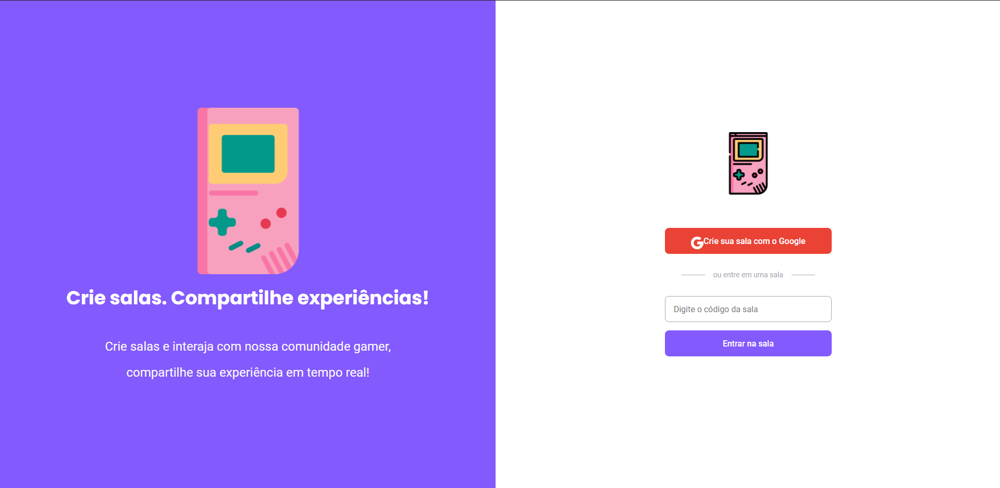

 

# Tecnologias

Esse projeto foi desenvolvido com as seguintes tecnologias:

### `React`

### `TypeScript`

### `SCSS`

### `Firebase`

## Projeto

Um Web Site em formato de forum, onde as pessoas podem enviar perguntas e respostas. 

## Como executar

### `Clone o repositório`

### `Instale as dependencias yarn`

### `Inicie o servidor com yarn dev`

Agora você pode acessar `localhost:3000` do seu navegador

